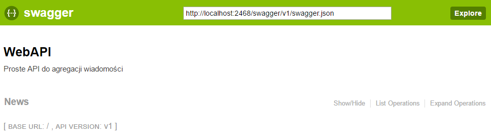
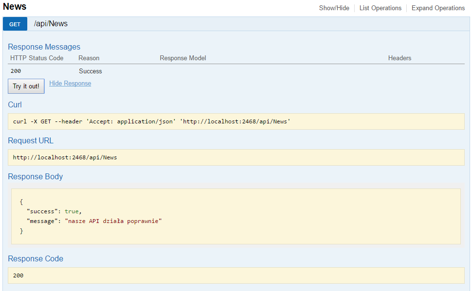

# Instrukcja do zadania

## Cel
Celem tego zadania jest zapoznanie się z pewnym sposobem projektowania aplikacji. 
Skupimy się na wykorzystaniu Entity Frameworka do komunikacji z bazą danych oraz 
zastosujemy Dependency Injection, które będzie używane w naszych repozytoriach, o czym słów kilka później.

## Wymagania wstępne
Aby zacząć wykonywać zadanie należy pobrać repozytorium na swój komputer.
Następnie należy otworzyć projekt i poczekać kilka chwil, aż Visual Studio pobierze wymagane pakiety z Nugeta.

## Opis projektu
W przygotowanym projekcie zostały skonfigurowane niezbędne moduły, z których będziemy korzystać. Jest to czasochłonne, dlatego taka decyzja.

### WebAPI
Projekt sam w sobie będzie dostawcą jedynie samego API. Oznacza to, że nie będziemy mieli interfejsu użytkownika. Jednak, aby ułatwić zadanie,
dołączony został dodatek, który będzie generował wszystkie publiczne wejścia do API. To, w jaki sposób z niego korzystać omówię bezpośrednio przy zadaniu.

### Entity Framework
W projekcie użyty został Entity Framework. Jest to jedna z najpopularniejszych bibliotek wspierająca aplikacje komunikające się z bazą danych.
Jest to biblioteka pozwalająca mapować obiekty bazodanowe na klasy po stronie C#. Ułatwia to niezwykle pracę i pozwala na utrzymanie jednolitej struktury, 
po stronie serwera bazy danych oraz po stronie aplikacji.

### Dependency Injection
Po polsku - wstrzykiwanie zależności - jest to wzorzec projektowy. Jego głównym zadaniem jest usunięcie bezpośrednich zależności w kodzie pomiędzy komponentami.
Zamiast tworzyć obiekty bezpośrednio (np. poprzez new) będziemy je wstrzykiwać do naszego kodu. Sprowadza się to do tego, że mamy w naszej
aplikacji pewien kontener (fabrykę), która dostarcza nam obiekty, które aktualnie potrzebujemy. W ten sposób, my mówimy co chcemy i to dostajemy.
Proces fizycznego tworzenia bytu odbywa się na zewnątrz (w fabryce). Dzięki temu, obiekt tworzony jest raz. Przy pierwszym odwołaniu. 
Przy kolejnych próbach będziemy dostawali już utworzony wcześniej obiekt.

Na potrzeby projektu skupimy się na wstrzykiwaniu jedynie kontekstu bazy danych oraz repozytoria.

### Repozytorium
Będziemy tak nazywać pewną klasę, która dostarczać będzie dane z bazy. Np. repozytorium o nazwie NewsRepository będzie dostarczało nam danych o newsach, które znajdują się fizycznie w tabelce News.

## Zadanie 1
Zadanie pierwsze polegać będzie na zapoznaniu się z projektem, WebAPI oraz uruchomieniem dokumentacji naszego API.

Zaczynamy!

Proszę uruchomić projekt w Visual Studio. Można to zrobić otwierając plik `ZadanieLaboratoryjneDotNet.sln`

> Aby uruchomić projekt należy przejść do menu:
> > Debug -> Start Debugging
  
Po pobraniu wszystkich pakietów, proszę przejść do kontrolera o nazwie News `src/Controllers/api/NewsController.cs`
  
Widzimy tutaj nasz pierwszy kontroler. Stworzyłem w nim dwie metody. Pierwsza z nich to metoda, która odpowiada na rządanie GET, które nie ma parametrów. Możemy założyć, że każda metoda naszego API będzie zwracała typ wyniku ActionResult a zwracać będziemy obiekt typu JsonResult. Do tego miejsca dostaniemy się wchodząc pod adres:
>/api/news

Dla nas ważnym elementem będzie atrybut znajdujący się nad metodą:
```csharp
[HttpGet]
```
Samo HttpGet oznacza, że metoda poniżej może być wywołana tylko rządaniem GET (bez parametrów). W przypadku, gdy chcemy dołożyć parametr dodatkowy, np. id (identyfikator), albo searcg (ciąg wyszukiwania) -> wtedy musimy skorzystać z nieco bardziej rozbudowanej wersji, którą widzimy w drugiej metodzie tego kontrolera.
```csharp
[HttpGet("{message}")]
public ActionResult MetodaParametryzowana(string message) {
  ...
}
```
W tym przypadku również akceptujemy tylko rządzanie GET, jednak wymagany jest parametr message. Parametr ten dodajemy w atrybucie HttpGet oraz jako parametr metody. Do takiej metody możemy się dostać z następującego adresu:
>/api/news/toJestNaszParametr

Analogicznie, w przypadku dwóch i więcej atrybutów:
```csharp
[HttpGet("{parametr1}/{parametr2}/{parametr3}")]
public ActionResult MetodaParametryzowana(string parametr1, string parametr2, int parametr3) {
  ...
}
```
Dostęp przez np.:
>/api/news/pierwszyParametr/drugiParametr/432

### Dostęp przez dokumentację
Dobrze, potrafimy już uruchomić nasze API ręcznie. Jednak - nie zawsze chcemy ręcznie tworzyć obiekty. Niekiedy jest to skomplikowane. 
Z pomocą przychodzą dodatki generujące dokumentację. W naszym projekcie użyłem Swagger UI. Aby go uruchomić należy uruchomić projekt a następnie przejść pod adres:
> /swagger/ui/index.html

Powinniśmy zobaczyć następujące okno:


W tym miejscu możemy wybierać nasze kontrolery, a następnie przeglądać dostępne akcje (metody). Swagger podpowiada również jakie są dozwolone zapytania wejściowe i możemy je wykonać, co widać na zrzucie:


W tym zadaniu zapoznaliśmy się z projektem, uruchomiliśmy nasze API i zrobiliśmy pierwsze rządanie. Teraz czas na bardziej praktyczną część...

## Zadanie 2
W tym zadaniu nauczymy się jak podpiąć nasze repozytorium do API w kontrolerze `NewsController`, aby pobierał dane z bazy.

W tym celu na początku kontrolera należy zadeklarować nasze rerpo - będzie to interfejs `INewsRepository` oraz skorzystamy z DI, które dostarczy nam nasze repo w konstruktorze. Korzystamy bowiem ze wstrzykiwania zależności przez konstruktor. Cały kod, który należy zaimplementować w kontrolerze wygląda następująco:
```csharp
private INewsRepository NewsRepository { get; set; }

public NewsController(INewsRepository repo)
{
    NewsRepository = repo;
}
```
Widzimy tutaj deklarację zmiennej prywatnej i typie interfejsu `INewsRepository`. Następnie w kontrolerze, przyjmującym jako parametr dokładnie taki sam typ czyli `INewsRepository` przypisujemy do naszej zmiennej. Jak widzimy - nie użyliśmy słówka `new` a mimo to, nasze repozytorium zadziała. Dzieje się tak, ponieważ korzystamy z mechanizmu DI. Na potrzeby projektu został on tak skonfigurowany, że wszystkie pliki, które kończą się na `Repository` oraz `Service` będą wstrzykiwane przez konstruktor - czyli w parametrach będziemy podawali kolejne byty, które chcemy wstrzyknąć. Ponadto wymagane jest, aby te repozytoria i serwisy, które wstrzykujemy implmenetowały interfejs. W rezultacie powinniśmy otrzymywać paczkę dwóch plików: `INazwaRepo` jako interfejs oraz `NazwaRepo` jako klasa implementująca ten interfejs.

Mamy już repozytorium, także czas, aby z niego skorzystać. W tym celu proszę usunąć istniejące metody testowe w kontrolerze `NewsController`. Stworzymy nową metodę, która będzie odpowiadała na bezparametrowe rządanie `GET`. Bazując na testowych przypadkach, wiemy jak stworzyć taką metodę. Jedyną różnicą jaka się pojawi, będzie pobranie danych używając repozytorium.
```csharp
[HttpGet]
public ActionResult GetAll()
{
    return new JsonResult(new
    {
        success = true,
        data = NewsRepository.GetAllNews()
    });
}
```
Dobrze, co tu się dzieje -> widzimy metodę z nagłówkiem `[HttpGet]` czyli rządanie GET bez parametrów. Celem metody `GetAll` jest zwrócenie w postaci wyniku JSON obiektu z najnowszymi newsami. Wynikiem metody jest `JsonResult`, czyli typ, z któego będziemy korzystali w każdej z metod. Jako parametr możemy podać dowolny typ. Ja użyłem dynamicznego typu anonimowego. czyli: `new { }`. Dzięki temu mamy dowolność, jeżeli chodzi o atrybuty danego obiektu. W tym przypadku widzimy dwa paramtery: `success` oraz `data`.
Do `data` przypisujemy wynik z metody `GetAllNews` znajdującej się w repozytorium `NewsRepository` - czyli tak jak chcieliśmy.

## Zadanie 3
Proszę o dodanie repozytorium, które obsłuży model, który przygotowałem do tego ćwiczenia - jest to model `Model/Category.cs`.
Jest to bardzo prosty model zawierający jedynie `Id` oraz `Nazwa` dla kategori. Chciałbym, aby w repozytorium znalazły się dwie metody. Jedna `GET` pobierająca wszystkie kategorie z bazy danych. Druga - `POST` przyjmująca jako parametr jedynie ciąg znaków - `string`, jej zadaniem będzie wstawienie nowej kategori do bazy danych.
